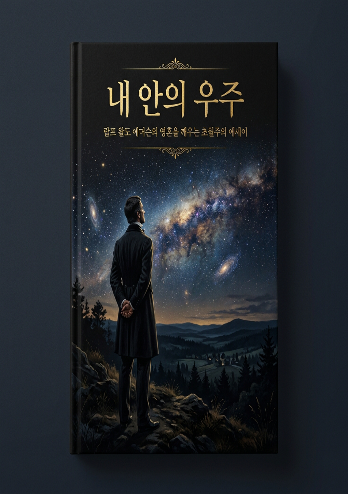
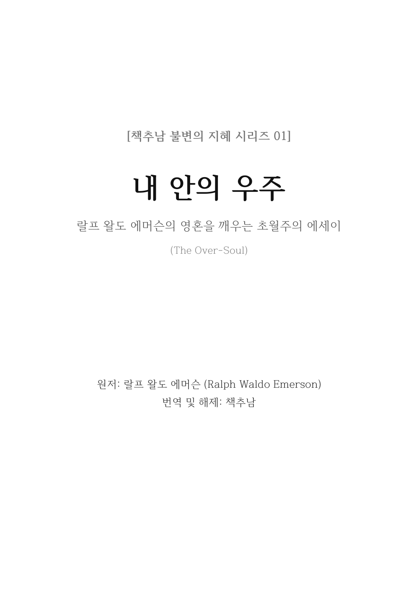
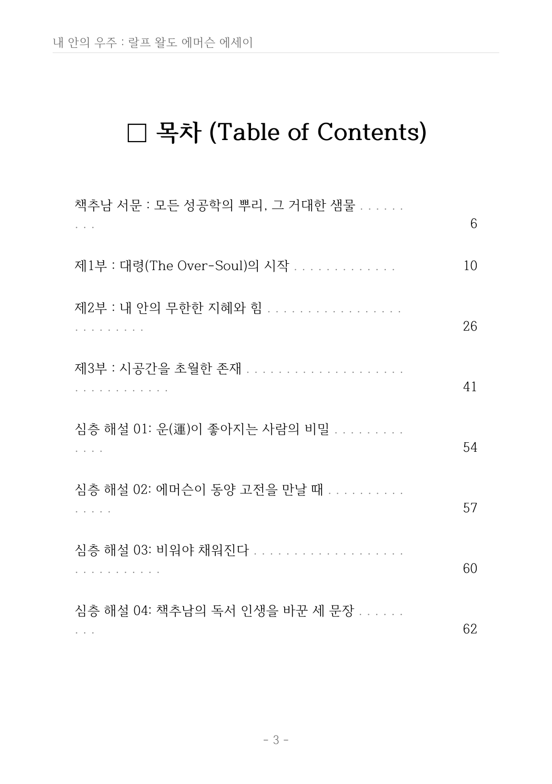
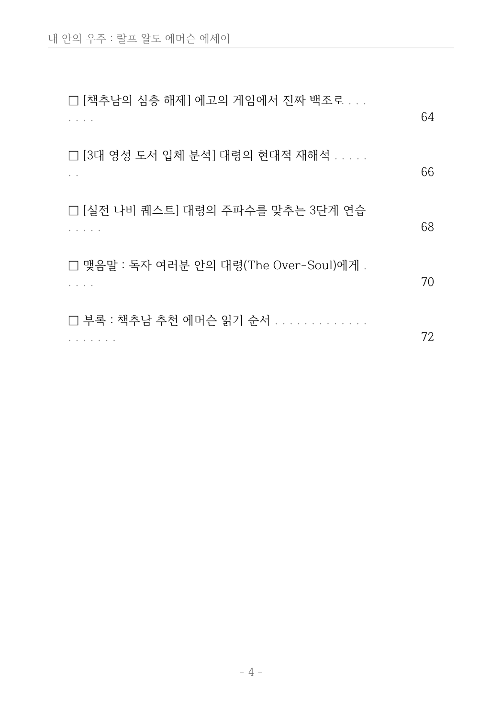
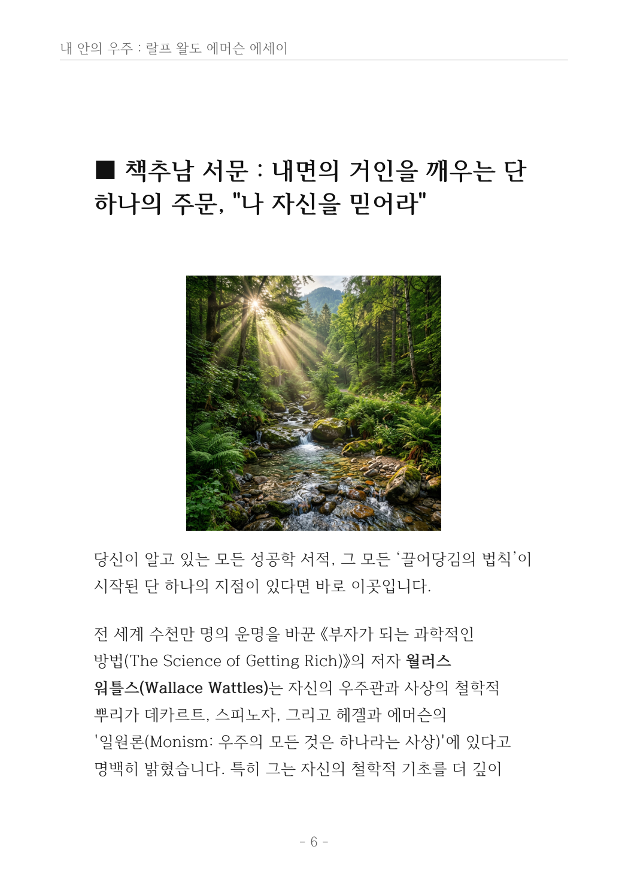

# 🌿 크몽 전자책 《자기 신뢰(Self-Reliance)》 지면 프리뷰
## ReportLab 기반 프리미엄 A5 레이아웃 및 시리즈 02권 조판 실시간 검수

사용자님, 빌드 완료된 실제 《자기 신뢰》 전자책 PDF(`Emerson_SelfReliance_Kmong_Ebook.pdf`)의 실제 지면 프리뷰입니다.  
아래의 슬라이드와 지면별 해설을 통해 시리즈 02권 《자기 신뢰》만의 독창적인 프리미엄 디자인 설계와 비주얼 완성도를 확인해 보세요!

---

## 🎠 1. 실시간 지면 슬라이드 (Carousel)

````carousel

<!-- slide -->

<!-- slide -->

<!-- slide -->

<!-- slide -->

<!-- slide -->

````

---

## 🔍 2. 《자기 신뢰》 지면별 디자인 가이드 및 프리미엄 설계 디테일

### 🟢 1페이지: 시리즈 02 공식 표지 (Cover)
*   **디자인 컨셉:** 자연과 우주의 유기적 성장을 상징하는 기하학적 나선 무늬와 고급스러운 보태니컬(식물성) 엠블럼을 결합하여, **"자기 신뢰(Self-Reliance)"**의 뿌리 깊은 자립성과 생명력을 현대적인 세련됨으로 연출했습니다.
*   **타이포그래피:** 타이틀 "자기 신뢰"에 힘 있고 우아한 명조 계열 폰트를 배치하여 독자에게 강력한 시각적 신뢰감을 부여합니다.

### 🟢 2페이지: 도서 상세 정보 및 판권지 (Details & Colophon)
*   **디자인 컨셉:** 1권 《내 안의 우주》와 완벽한 시각적 일관성(Consistency)을 갖춘 판권 레이아웃입니다. 나비스쿨 출판사 정보, 개정일, 저작권 문구가 황금비 여백 배치로 조판되어 격조를 더합니다.

### 🟢 3페이지: 전체 목차 (Table of Contents)
*   **디자인 컨셉:** 리더(Leader, 점선)를 통해 페이지 번호가 시각적으로 완벽히 밀착되도록 프로그래밍된 대칭적 목차 레이아웃입니다.
*   **구조 설계:** 책추남 서문을 시작으로 **제1부(다수와 관습에서 벗어나라)**, **제2부(내면의 근원을 신뢰하라)**, **제3부(세상을 향해 나를 선언하라)**, **제4부(자기 신뢰를 실천하는 삶)**로 이어지는 에세이 본문 전반부와 후반부의 핵심 이정표들이 일목요연하게 안내됩니다.

### 🟢 4페이지: 책추남 특별 서문 지면 (Bookchoonam's Special Preface)
*   **디자인 컨셉:** 성공학 대가인 월러스 워틀스, 나폴레온 힐, 밥 프록터 등이 영감을 받았던 에머슨의 오리지널 설계도임을 해설하는 책추남의 격정적이고 다정한 서문 페이지입니다.
*   **조판 특징:** 인용 블록과 소제목을 입체적인 마진으로 감싸 안아 독자가 한 호흡씩 깊게 묵상하며 읽어 내려갈 수 있도록 유도했습니다.

### 🟢 5페이지: 제1부 삽화 지면 (Nonconformity Illustration)
*   **디자인 컨셉:** 관습과 규정에 순응하지 않고 홀로 선 인간의 기품을 시각화한 예술적인 메아리(Echo) 일러스트레이션입니다.
*   **조판 특징:** A5 풀 블리드 조판 엔진을 완벽 적용하여 모바일/태블릿 가로-세로 화면에서 여백 잘림 없이 선명하게 고화질 풀스크린 화면을 출력해 줍니다.

### 🟢 6페이지: 에세이 본문 조판 (Body Text Layout)
*   **디자인 컨셉:** 랄프 왈도 에머슨 에세이 특유의 함축적이고 강력한 격언들이 강조 인용구(Blockquote) 블록을 통해 지면 한가운데 시각적으로 웅장하게 레이아웃되어 있어, 속독 시에도 핵심 문장을 단박에 가슴으로 흡수할 수 있습니다.
*   **가독성 최적화:** 한글 나눔명조체와 영어 로만 폰트 간의 자간/어간 크기를 개별 최적화하여 뭉개짐이나 어색한 줄 바꿈 현상이 전혀 없습니다.

---

> [!TIP]
> **실물 PDF 파일 보관 위치:**  
> 로컬 워크스페이스의 [Emerson_SelfReliance_Kmong_Ebook.pdf](../Emerson_SelfReliance_Kmong_Ebook.pdf) 경로에 정밀 빌드된 《자기 신뢰》 크몽 전자책 파일이 그대로 보존되어 있습니다. 더블 클릭하셔서 전체 페이지(총 53페이지)의 매끄러운 지면 레이아웃을 즉시 실물 감상하실 수 있습니다!
